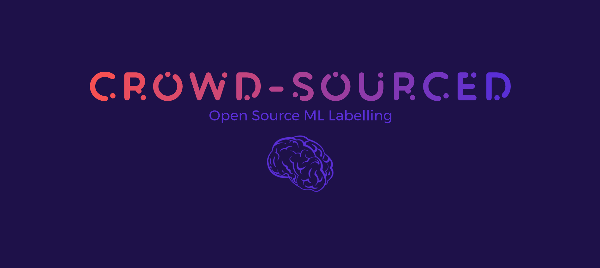

# crowd-sourced

<!-- PROJECT SHIELDS -->
[![Contributors][contributors-shield]][contributors-url]
[![Forks][forks-shield]][forks-url]
[![Stargazers][stars-shield]][stars-url]
[![Issues][issues-shield]][issues-url]
[![MIT License][license-shield]][license-url]

<!-- PROJECT LOGO -->
<br />
<p align="center">
  <a href="https://github.com/baioc/crowd-sourced">
    
  </a>  

  <h3 align="center">crowd-sourced</h3>
  <p align="center">
    An awesome open source 'ML As A Service' project to get high quality labels for your models!
    <br />
    <a href="https://github.com/baioc/crowd-sourced"><strong>Explore the docs »</strong></a>
    <br />
    <br />
    <a href="https://www.youtube.com/watch?v=XNZi2ZzW1Q0">View Demo</a>
    ·
    <a href="https://github.com/baioc/crowd-sourced/issues">Report Bug</a>
    ·
    <a href="https://github.com/baioc/crowd-sourced/issues">Request Feature</a>
    ·
    <a href="https://crowd-sourced.vercel.app/">Vercel View</a>
  </p>
</p>

<p align="left">
 <a href="#">


   


   
  </a>
</p>

## Table of contents

- [crowd-sourced](#crowd-sourced)
  - [Table of contents](#table-of-contents)
  - [About the project](#about-the-project)
  - [Built With](#built-with)
  - [Features](#features)
  - [Getting Started](#getting-started)
    - [Prerequisites](#prerequisites)
    - [Installation](#installation)
  - [Code Management](#code-management)
  - [Challenges we ran into](#challenges-we-ran-into)
  - [Accomplishments that we're proud of](#accomplishments-that-were-proud-of)
  - [What we learned](#what-we-learned)
  - [What's next for Crowd Sourced](#whats-next-for-crowd-sourced)
  - [Video Demo](#video-demo)
  - [Special thanks](#special-thanks)
  - [Contributing](#contributing)
  - [License](#license)
  - [Usage](#usage)

## About the project

We chose to work on a crowd-sourced tool for data labeling, to simplify the data pipeline for deep learning models.

Nowadays we have amazing tools at our disposal, like systems for language translation, or movies recommendation, computer vision and autonomous driving, and much more! But all these systems are very data-hungry, and most of the time of a Deep Learning engineer can be spent on data collection and preparation. With the right tools, like ours, this time can be reduced.

But not only: lots of data is not enough, we need to ensure that the quality of the data is high. From this perspective, leveraging an open-source crowd-sourced platform is a unique opportunity to achieve a gold standard in data quality and to work towards building an automated system that is more fair, inclusive, and resilient to bias.

Thus, [Crowd Sourced][Crowd Sourced] is a free platform that lets users from all around the world contribute to labelling textual and graphical data for the intention of data for machine learning and as a open source way of collecting human labelled, gold standard data for machine learning models.

This project comes with a basic UI support, an easy to use interface, set of ready to use interactions and most importantly, all of the content provided with ease for the user to label, so that you can have whatever data for labelling you like in the database without worrying about how the data will be served and labelled.

## Built With

This section lists down the technologies which were used in the making of this wesome project! They are,

- Makefile ❤️ scripts for automating many of the processes
- Black (formatting) ❤️ Flake8 (linting)
- FlaskAPI ❤️ MongoEngine (ORM) ❤️ VirtualEnv
- Reacts ❤️ Material UI ❤️ yarn
- EsLint with React to make sure no bugs arose
- GitHub ❤️ with the issue and a pull request template
- MongoDB as the database used
- Docker/Docker Compose
- Linux ❤️ wget ❤️ zip for automating dataset generation and setup
- Python ❤️ requests lib, for using API from Unsplash

## Features

The web application is built by keeping the following aspects in mind,

- 🎁 **Modern** – Project created using the latest features of React (State management using Hooks)

- 💻 **Responsive** – Highly responsive and reusable UI components, that change depending on the provided props, since the UI library used here will be Material UI, which provides responsive components out of the box already

- 🚀 **Fast** – Buttery smooth experience thanks to the light weight implementation of best practices in ReactJS

- ⚙️ **Maintenance** - The project is built with Docker Compose, following the easiness of adding and removing services, with easy to add code for maintainability purposes

<!-- GETTING STARTED -->
## Getting Started

This section deals with how the instructions for setting this project up your machine locally

### Prerequisites

To start and build the project, you need to have,

- **Docker** on your machine. Here is [how](https://docs.docker.com/engine/install/!)
- **yarn** - you can get the that [here](https://classic.yarnpkg.com/en/docs/install/#debian-stable)
- **Linux** - this project was built with developers using Linux, since the main build is done with `Makefile`

### Installation

After you've setup docker, simply follow the steps, or just run the code snippet at the end of this seciton,

1. Clone the project, `git clone https://github.com/baioc/crowd-sourced`
2. Then go into the project, `cd crowd-sourced`
3. Go into the client folder with, `cd client/`, and run `yarn`
4. Simply run, `make build-dev`. This simply builds the dev version of the project for now. It will first begin to download some basic Docker files, but at the end ( it might take 2-3 minutes in the 1st attempt ), in the end, it will give you an output like this,


Once down, simply visit `http://localhost:3000/`, and `http://localhost:8080/`, you should see pages similar to the pages below,


Or simply, run the following commands!

```bash
git clone https://github.com/baioc/crowd-sourced
cd crowd-sourced
cd client
yarn
cd ..
make buil-dev
```

## Code Management

To also `format` and `lint` the Pythonic code for the FlaskAPI, run the following commands while in the `root`,

```bash
python -m venv venv
source venv/bin/activate
pip install -r requirements.txt
make precommit
```

This will perform `formatting` with `black`, and `linting` with `flake8`.

### Datasets setup

Download the datasets:
```bash
make datasets-download
```

Loading to `MongoDB`:
```bash
make datasets-setup
```

## Challenges we ran into

Quite a lot,

- Deciding on the details of the workflow
- Deciding on the technology, and making it easy for everyone to follow along with all the issues and the work needed to be done
- Deciding on the UI, and the whole team keeping on par with the quick learning curve and idea
- Trying to convert the idea into the most MVP like as much as possible
- Maintaining best practices with branches, Github issues & PRs
- Making sure everyone was on the same page
- Dealing with hidden bugs with Docker Compose, MongoDB, the server especially
- Having to deploy the frontend somewhere
- Linting, formatting, to make sure the code quality was high
- Simplifying many processes by using a Makefile

## Accomplishments that we're proud of

We're proud of a couple of things,

- Very rapid development
- Rapid learning and understanding of the solution
- Quickly adapting to a workflow
- Not getting overwhelmed with a sense of feeling we won't make it
- Including so many technologies, stacks, and overall ideas to get this MVP out there
- Discussing very frequently and keeping in touch with everyone to make sure good progress is made
- An issue/PR/branch system of GitHub. As of now, we have 6 closed issues, 2 open issues, and 16 closed PRs, with a total of 70 commits
- Overall, having fun!

## What we learned

A lot, for all of us,

- On technical expertise, JS, Python, Automating, Bash Scripting, Dataset generation, API calls, Makefile
- From a people perspective, time zone communication, deciding on a solid single idea and building on top of that

## What's next for Crowd Sourced

Expanding a bit more on the idea, letting users upload their own data, letting 3rd party websites use this functionality in their own web applications, a bit like google captcha. We might go on to make a personal profile for each user, with proper authentication and everything, for each user to upload his/her own personal datasets to be labeled, and then easily introducing a more expansive platform with deals with audio and other formats of data sets well.

## Video Demo

The video demo can be found below,

[](https://www.youtube.com/watch?v=XNZi2ZzW1Q0)

## Special thanks

[Major League Hacking][MLH] - for the opportunity to be part of this hackathon

<!-- CONTRIBUTING -->
## Contributing

Contributions are what make the open source community such an amazing place to be learn, inspire, and create. Any contributions you make are **greatly appreciated**.

1. Fork the Project
2. Create your Feature Branch (`git checkout -b feature/AmazingFeature`)
3. Commit your Changes (`git commit -m 'Add some AmazingFeature'`)
4. Push to the Branch (`git push origin feature/AmazingFeature`)
5. Open a Pull Request

<!-- LICENSE -->
## License

Distributed under the *GNU General Public License v3.0* License. See `LICENSE` for more information.

## Usage

Use it for whatever machine learning ideas you have! Happy hacking!

<!-- prettier-ignore-start -->
[axios]: https://github.com/axios/axios
[antd]: https://github.com/ant-design/ant-design
[react-awesome-reveal]: https://www.npmjs.com/package/react-awesome-reveal
[styled-componets]: https://github.com/styled-components/styled-components
[Crowd Sourced]: https://github.com/baioc/crowd-sourced
[MLH]: https://mlh.io/
<!-- prettier-ignore-end -->

<!-- MARKDOWN LINKS & IMAGES -->
<!-- https://www.markdownguide.org/basic-syntax/#reference-style-links -->
[contributors-shield]: https://img.shields.io/github/contributors/baioc/crowd-sourced.svg?style=for-the-badge
[contributors-url]: https://github.com/baioc/crowd-sourced/graphs/contributors
[forks-shield]: https://img.shields.io/github/forks/baioc/crowd-sourced.svg?style=for-the-badge
[forks-url]: https://github.com/baioc/crowd-sourced/network/members
[stars-shield]: https://img.shields.io/github/stars/baioc/crowd-sourced.svg?style=for-the-badge
[stars-url]: https://github.com/baioc/crowd-sourced/stargazers
[issues-shield]: https://img.shields.io/github/issues/baioc/crowd-sourced.svg?style=for-the-badge
[issues-url]: https://github.com/baioc/crowd-sourced/issues
[license-shield]: https://img.shields.io/github/license/baioc/crowd-sourced.svg?style=for-the-badge
[license-url]: https://github.com/baioc/crowd-sourced/blob/master/LICENSE.txt
